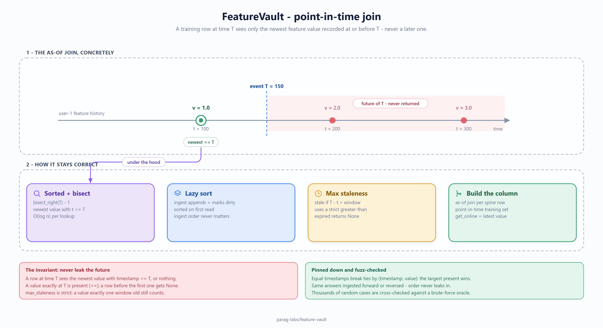

# feature-vault: design, trade-offs, and non-goals

Status: accepted
Author: Parag Sawant

Why feature-vault is built the way it is. A feature store has one job that's hard to
get right and catastrophic to get wrong - point-in-time-correct joins - so the whole
design bends around making that property provable rather than merely intended.

## Problem and goals

When you build a training set from historical features, each row must see only the
feature values that existed at or before that row's event time. If a join ever pulls in
a value recorded *after* the event, you've leaked the future: offline metrics look
great, and the model falls apart in production because that information won't exist at
serving time. feature-vault is a minimal store built to make that leak impossible.
Goals:

1. **Point-in-time-correct ("as-of") joins** - for a row at time T, return the newest
   feature value with timestamp <= T, and never anything newer.
2. **Optional staleness bounds** - a value older than `max_staleness` is treated as
   expired (None), because a stale feature is often as wrong as a missing one.
3. **The same logic in three languages**, with integer timestamps, so the port is exact.

*(Source: [`docs/diagrams/point-in-time-join.excalidraw`](docs/diagrams/point-in-time-join.excalidraw) - editable in [excalidraw](https://aka.ms/excalidraw).)*

## The one invariant everything protects

No join ever returns a value from the future. That's the property, and it's stated as
a single sentence on purpose - it's the thing the leakage fuzz suite checks thousands of
times against a brute-force oracle: for random ingest orders, event times, and staleness
windows, the returned value must be exactly the newest value at-or-before the event
time, or nothing.

## Key design decisions

**Sorted timestamps per entity + binary search.** Each entity's observations are kept
time-ordered, and a lookup is `bisect_right(event_time) - 1` - the last value at or
before the row's time, in O(log n). This is both the fast path and the *correct* path:
the same structure that makes lookups cheap is what makes "at or before" exact, with no
off-by-one that could admit a future value.

**Lazy sort, not sort-on-every-ingest.** Ingest just appends and marks the entity
dirty; the sort happens on first read. Feature ingestion is often bursty and reads come
later, so deferring the sort avoids re-sorting on every append. The result is identical
regardless of ingest order - the fuzz suite asserts that explicitly by ingesting the
same data forward and reversed and comparing every lookup.

**Deterministic tie-break on equal timestamps.** When two values share a timestamp, the
store returns a well-defined one (values are ordered by (timestamp, value), so the
largest value at that instant wins). Ties are still "present," not future, so this
doesn't affect the leak guarantee - but pinning the behavior down means the answer is
reproducible rather than dependent on insertion order.

## Trade-offs I made on purpose

- **In-memory, integer timestamps.** The store holds everything in memory and uses
  integer event times (epoch seconds). That keeps the logic tiny and portable to C#/Java
  and is right for building a training set from a bounded history; a production store
  backed by Parquet/columnar storage over billions of rows is a different engine with the
  same join semantics. Called out, not hidden.
- **Single feature value per lookup, not feature vectors.** The core returns one
  feature column at a time. Assembling many features into a row is a straightforward
  layer on top; keeping the primitive small keeps the correctness argument small.
- **Backward-looking join only.** It answers "as of T," which is what training-set
  construction needs. Interval/range features and future-window aggregations are
  deliberately out of scope.

## Why there's no throughput benchmark

The operation is a binary search - microseconds - and correctness, not speed, is the
property anyone cares about for a feature store. A throughput number would measure the
wrong thing. The leakage fuzz suite is the real deliverable: thousands of randomized
scenarios cross-checked against an independent oracle, proving the join never leaks the
future, honors staleness, and is independent of ingest order.

## Non-goals

- **Not a distributed feature store.** No storage backend, no online/offline sync
  service, no registry - it's the point-in-time join primitive done correctly.
- **Not a transformation framework.** It stores and serves values; computing features
  from raw data is upstream.
- **Not a serving system.** `get_online` returns the latest value for convenience, but
  there's no low-latency serving layer, caching, or API here.

Part of [parag-labs](https://github.com/parag-labs) - small, focused tools for building AI systems you can trust.
